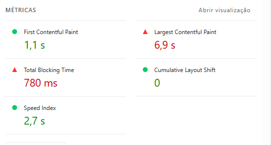
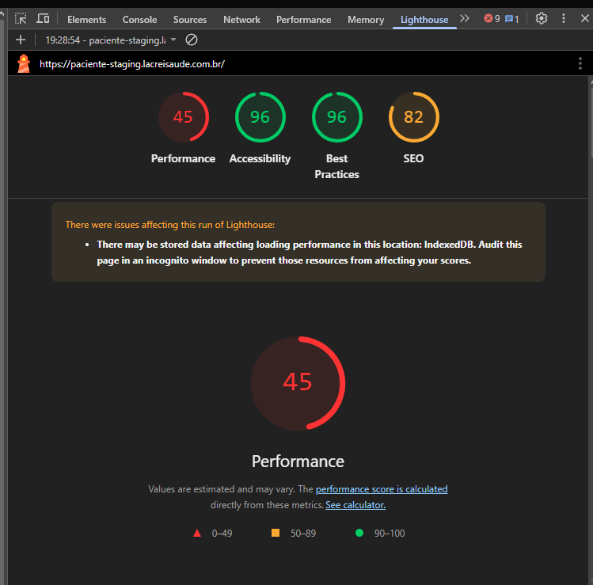
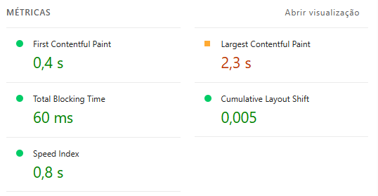
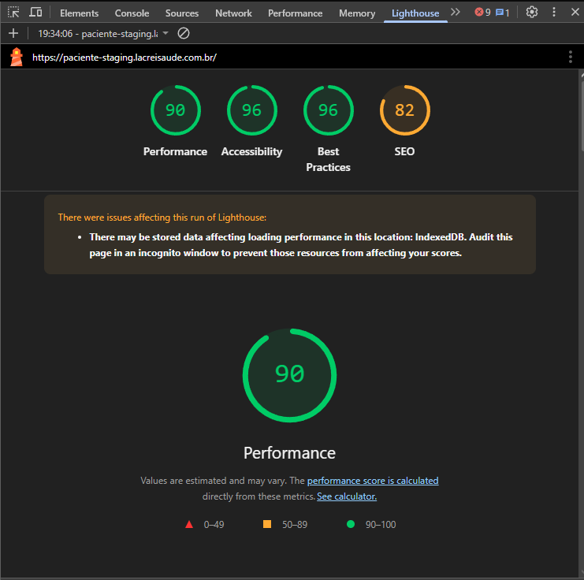

# 🚀 Teste de Performance - Lighthouse

**Ferramenta utilizada:** Google Lighthouse  
**Navegador:** Opera  

---

## 🌐 Ambiente de teste

**URL testada:**  
https://paciente-staging.lacreisaude.com.br/

**Data do teste:**  
09/03/2026

---

# 📱 Teste Mobile

## 📊 Resultados

- **Performance:** 45  
- **Accessibility:** 96  
- **Best Practices:** 96  
- **SEO:** 82  

### ⚡ Métricas detalhadas:

- **FCP (First Contentful Paint):** 1.1s  
- **LCP (Largest Contentful Paint):** 6.9s  
- **CLS (Cumulative Layout Shift):** 0  
- **TBT (Total Blocking Time):** 780ms  
- **Speed Index:** 2.7s  

---

## 📎 Evidência

---

## 🔎 Análise

- **FCP (1.1s)** → Bom tempo de carregamento inicial  
- **LCP (6.9s)** → Alto (ideal < 2.5s), indicando lentidão no carregamento do conteúdo principal  
- **CLS (0)** → Excelente estabilidade visual (sem mudanças inesperadas de layout)  
- **TBT (780ms)** → Alto, indicando possível bloqueio da thread principal por scripts  
- **Speed Index (2.7s)** → Razoável, mas pode ser otimizado  

### ⚠️ Observação

A pontuação de **performance em dispositivos móveis está baixa (45)**, indicando problemas de otimização, principalmente relacionados ao tempo de renderização do conteúdo principal (LCP) e bloqueios de processamento (TBT).

---

# 💻 Teste Desktop

## 📊 Resultados

- **Performance:** 90  
- **Accessibility:** 96  
- **Best Practices:** 96  
- **SEO:** 82  

### ⚡ Métricas detalhadas:

- **FCP (First Contentful Paint):** 0.4s  
- **LCP (Largest Contentful Paint):** 2.3s  
- **CLS (Cumulative Layout Shift):** 0.005  
- **TBT (Total Blocking Time):** 60ms  
- **Speed Index:** 0.8s  

---

## 📎 Evidência

---

## 🔎 Análise

No ambiente **desktop**, a performance apresentou pontuação satisfatória (90), indicando melhor otimização para dispositivos com maior capacidade de processamento.

---

# 📌 Conclusão

Foi identificada uma diferença significativa de performance entre **Mobile e Desktop**, com impacto direto na experiência do usuário em dispositivos móveis.

## 🚨 Principais pontos críticos

- **LCP elevado (6.9s)** → atraso no carregamento do conteúdo principal  
- **TBT alto (780ms)** → possível excesso de scripts bloqueantes  

## ✅ Pontos positivos

- **FCP rápido (1.1s)**  
- **CLS excelente (0)**  
- Boa pontuação em acessibilidade  

---

## 🚀 Recomendações de melhoria

- Otimização de imagens (compressão e lazy loading)  
- Redução de scripts bloqueadores  
- Uso de carregamento assíncrono (`async` / `defer`)  
- Code splitting para reduzir bundle inicial  
- Priorização do carregamento do conteúdo principal (melhoria de LCP)  

---

## 🧪 Cenário de teste de performance

Os testes de desempenho foram baseados nos cenários descritos no arquivo:
