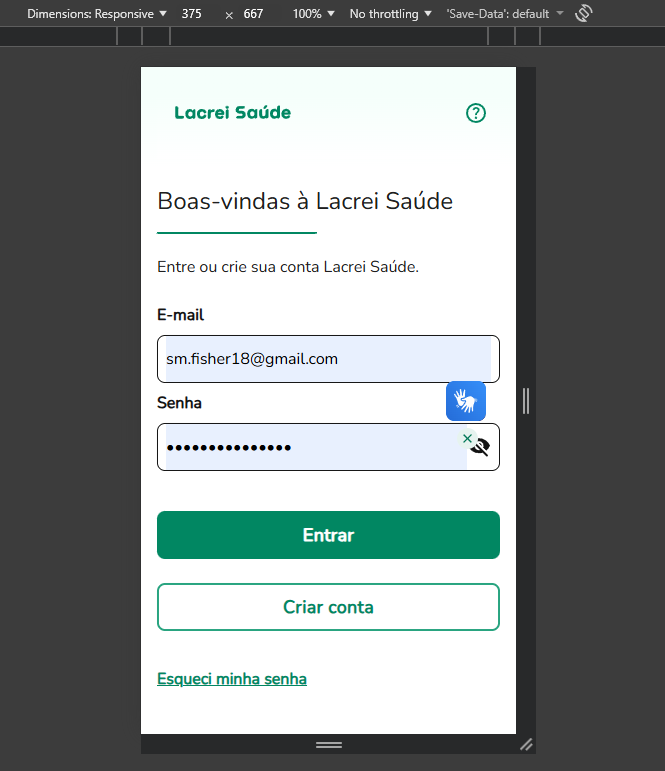
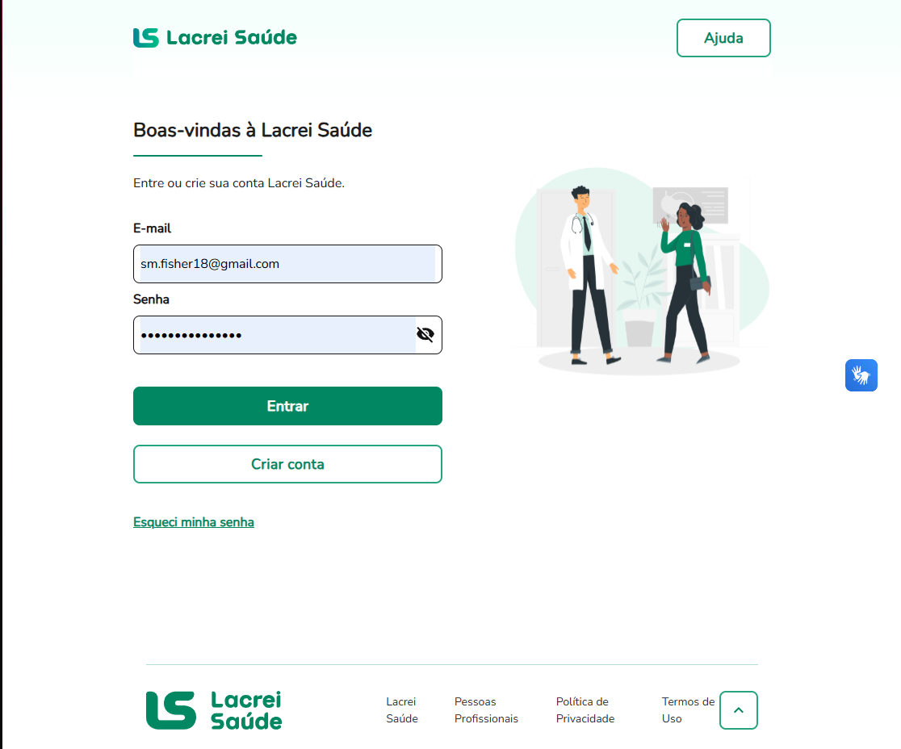

# Teste de Responsividade – Lacrei Saúde

## Ferramenta utilizada

- DevTools (modo responsivo)

## URL testada

https://paciente-staging.lacreisaude.com.br/

---

## Cenários de teste

1. Validação do layout em dispositivos mobile (≤600px)
2. Validação do layout em desktop (>1024px)
3. Verificação de funcionalidade e usabilidade em diferentes resoluções

---

## Teste Mobile

Resolução testada:

375x667

Resultados:

- Layout adaptado corretamente
- Campos de formulário acessíveis
- Botões clicáveis
- Texto legível

Evidência:

---

## Teste Desktop

Resolução testada:

1366x768

Resultados:

- Layout exibido corretamente
- Elementos alinhados
- Funcionalidades operando normalmente

Evidência:

---

## Conclusão

A aplicação apresentou comportamento responsivo adequado nas resoluções testadas, mantendo layout, funcionalidade e usabilidade.

## Bug encontrado

Durante o teste de responsividade foi identificado um problema no menu mobile.

Descrição:
A opção "Sair da conta" não aparece quando a aplicação é acessada em resoluções mobile.

Impacto:
Usuários podem ter dificuldade para encerrar sua sessão.

Prioridade sugerida:
Média